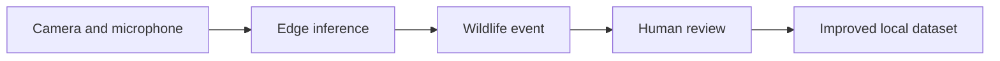

# Wilderness Dojo

**Field learning at the edge of ecology, artificial intelligence, and outdoor practice.**

[](https://wildernessdojo.github.io/)
[](https://floramedica.github.io/)
[](https://wildernessdojo.github.io/ARUDojo.html)
[](https://coderdojostpaul2group.slack.com/)

Wilderness Dojo is an open learning space for building and testing technology that helps people observe, understand, and care for wild environments. The site brings together biodiversity AI, autom[...]

> Listen carefully. Observe responsibly. Build for the field.

## Explore the dojo

| Experience | What it explores | Open |
| --- | --- | --- |
| **StarLens** | A visual portal for observing sky, signal, and place. | [Launch StarLens](https://wildernessdojo.github.io/StarLens/index-13.html) |
| **FloraMedica** | Offline-first plant identification with ethnobotanical knowledge. | [Open FloraMedica](https://floramedica.github.io/) |
| **Microsoft SPARROW ARU Dojo** | A workshop on ONNX, MegaDetector, bioacoustics, PyTorch-Wildlife, and human-reviewed wildlife observations. | [Enter the ARU Dojo](https://wildernessdojo.github.io/ARUDojo.html) |
| **ONNX Studio demo** | Inspect neural-network graphs and follow the wildlife inference workflow. | [Launch the Render app](https://gharial-ispa-rlhf.onrender.com/) |
| **Gharial ISPA RLHF** | Source code, model registry, TinyML work, and the experimental human-feedback layer used by the ARU workshop. | [View repository](https://github.com/stpaul2coderdojo/Gharial-ispa-RLHF) |

## What we build

- **Automatic recording units:** low-power audio and camera systems for biodiversity monitoring.
- **Edge AI:** portable ONNX and TinyML inference for places with limited connectivity.
- **Bioacoustics:** recording, detecting, reviewing, and learning from wildlife sound.
- **Plant intelligence:** field identification connected to Siddha, Ayurveda, Sowa-Rigpa, and edible-use knowledge.
- **Outdoor behavioural practice:** attentive observation, responsible fieldwork, and restorative learning outdoors.
- **Open workshops:** reproducible notebooks, worksheets, references, and community discussion.

## SPARROW ARU learning path

The ARU Dojo introduces the Microsoft biodiversity stack as an end-to-end field workflow:



Participants learn to distinguish the roles of:

- **SPARROW** — the solar-powered field monitoring system.
- **MegaDetector** — animal, person, and vehicle detection in camera-trap imagery.
- **MegaDetector Acoustic** — bioacoustic detection and classification.
- **MegaDetector Classifier** — species classification and regional fine-tuning.
- **PyTorch-Wildlife** — the shared inference framework and wildlife model zoo.
- **ONNX** — the portable graph format used to move neural networks between tools and runtimes.

Official upstream projects are collected in [Microsoft Biodiversity](https://github.com/microsoft/Biodiversity).

## Quick start

This repository is a static GitHub Pages site. No build step is required.

```bash
git clone https://github.com/stpaul2coderdojo/wildernessdojo.github.io.git
cd wildernessdojo.github.io
python -m http.server 8000
```

Then open `http://localhost:8000` in a browser.

### Main pages

```text
index.html
ARUDojo.html
StarLens/
└── index-13.html
```


## Workshop prerequisites

- A modern browser such as Chrome, Edge, or Firefox
- A GitHub account for cloud development workspaces
- A Google account for Colab notebooks
- Basic familiarity with Python, arrays, images, or sampled audio
- Headphones for acoustic exercises
- One permitted camera-trap image and a short WAV recording
- Optional local setup: Python 3.10+, Git, 8 GB RAM, and 5 GB free storage

## Field ethics

Wildlife observations are evidence, not just model inputs.

- Do not publish the coordinates of threatened or sensitive species.
- Remove or restrict identifiable images and recordings of people.
- Retain the original media, model version, threshold, preprocessing settings, and reviewer decision.
- Treat confidence scores as uncertainty estimates—not facts.
- Obtain permits and community consent where recording or deployment requires them.
- Avoid equipment placement that disturbs animals or changes their behaviour.

## Contributing

Contributions that improve accessibility, field reliability, documentation, worksheets, references, or conservation value are welcome.

1. Fork the repository.
2. Create a focused branch.
3. Test links and layout on both a phone/tablet and a desktop browser.
4. Keep external projects clearly attributed.
5. Open a pull request describing the field or learning problem addressed.

Please do not commit secrets, private location data, raw human recordings, large model weights, or media without a compatible licence.

## Community

- [CoderDojo St Paul Slack](https://coderdojostpaul2group.slack.com/)
- [Microsoft Biodiversity community and Discord](https://github.com/microsoft/Biodiversity#community)
- [Wilderness Dojo website](https://wildernessdojo.github.io/)

## Attribution

Microsoft SPARROW, MegaDetector, MegaDetector Acoustic, MegaDetector Classifier, and PyTorch-Wildlife are upstream open-source projects maintained by Microsoft and their contributors. Wilderness [...]

Review each upstream repository's current licence, model card, citation guidance, and deployment requirements before redistribution or operational use.

## Maintainer

Developed through **CoderDojo St Paul** and **Wilderness Dojo**.

